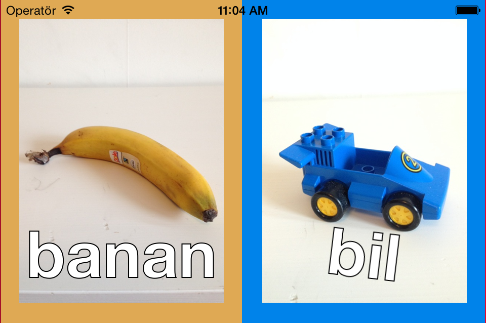

# ionic-sound-book
A super simple sound book hacked together for my son.



## Development
It's a hybrid app written in javascript with the [Ionic Framework](http://ionicframework.com/) and wrapped with [Cordova](http://cordova.apache.org/).

Caveat: it's a messy hack!

## Getting Started

If you want to contribute or just try it out:

```bash
$ git clone https://github.com/krawaller/ionic-sound-book.git
$ npm install -g ionic    # might need `sudo` depending on your node installation.
$ ionic serve    # to start the app in your web browser.
$ ionic emulate    # to run it in your simulator
$ ionic run    # to run it on your device
```

## Libraries

* [Ionic](http://ionicframework.com)
* [Cordova](http://cordova.apache.org/)
* [SoundJS](http://www.createjs.com/#!/SoundJS)
* [Phaser](http://phaser.io)
* [animate.css](http://daneden.github.io/animate.css/)

## License
MIT
